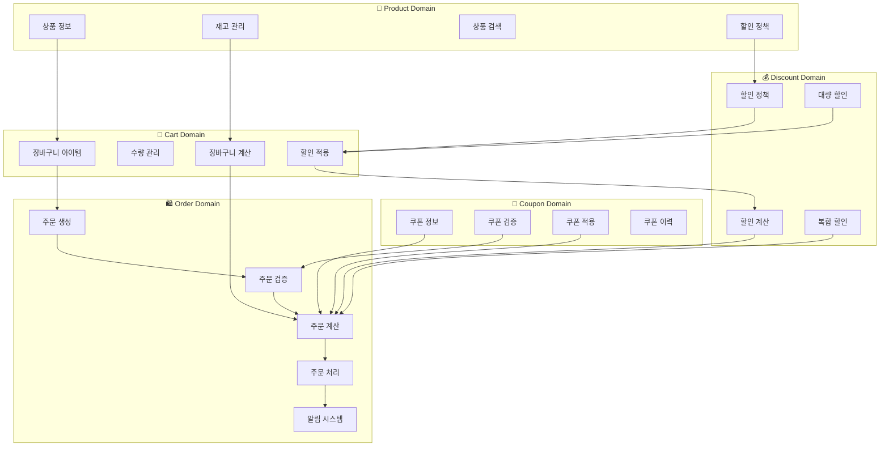
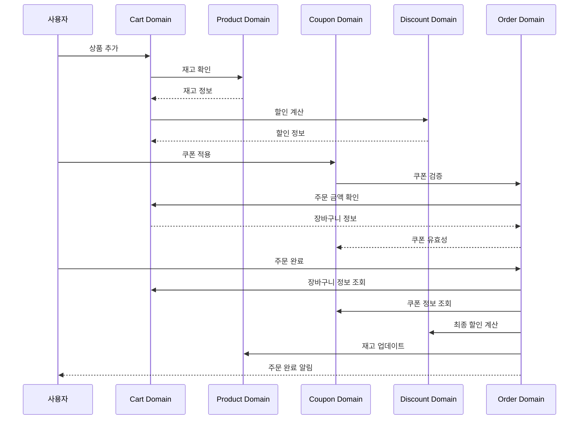
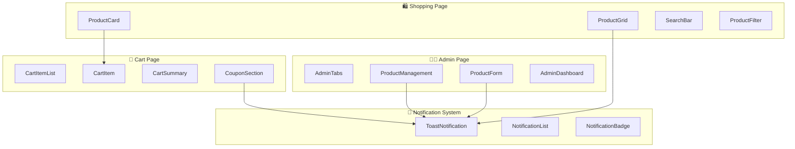
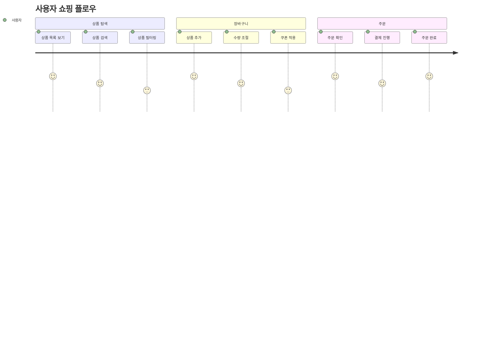

# 바운디드 컨텍스트 분석

## 🎯 현재 코드의 바운디드 컨텍스트 구조

현재 프로젝트를 분석한 결과, 다음과 같은 바운디드 컨텍스트들이 식별됩니다:

## 🏗️ 식별된 바운디드 컨텍스트

### 1. 🛒 **장바구니(Cart) 바운디드 컨텍스트**

#### 📁 위치: `src/basic/models/cart.ts`, `src/basic/store/use-cart-store.ts`

#### 🎯 책임

```typescript
// 장바구니 도메인 모델
interface CartDomain {
  // 장바구니 아이템 관리
  addItem(product: Product, quantity: number): CartItem;
  removeItem(productId: string): void;
  updateQuantity(productId: string, quantity: number): void;

  // 장바구니 계산
  calculateItemTotal(item: CartItem): number;
  getMaxApplicableDiscount(item: CartItem): number;

  // 장바구니 상태 관리
  getCart(): CartItem[];
  clearCart(): void;
}
```

#### 🔧 구현된 기능

- ✅ 장바구니 아이템 추가/제거
- ✅ 수량 조절
- ✅ 장바구니 계산 로직
- ✅ 할인 적용 로직
- ✅ localStorage 영속성

#### 🚨 누락된 기능

- ❌ 장바구니 유효성 검증
- ❌ 장바구니 이력 관리
- ❌ 장바구니 공유 기능

### 2. 🏪 **상품(Product) 바운디드 컨텍스트**

#### 📁 위치: `src/basic/models/product.ts`, `src/basic/store/use-product-store.ts`

#### 🎯 책임

```typescript
// 상품 도메인 모델
interface ProductDomain {
  // 상품 정보 관리
  createProduct(product: ProductView): Product;
  updateProduct(id: string, updates: Partial<ProductView>): Product;
  deleteProduct(id: string): void;

  // 상품 검색
  searchProducts(query: string): Product[];
  getProducts(): Product[];

  // 재고 관리
  checkStock(productId: string): number;
  updateStock(productId: string, quantity: number): void;
}
```

#### 🔧 구현된 기능

- ✅ 상품 CRUD
- ✅ 상품 목록 관리
- ✅ 상품 검색
- ✅ localStorage 영속성

#### 🚨 누락된 기능

- ❌ 재고 관리 로직
- ❌ 상품 분류/카테고리
- ❌ 상품 이미지 관리
- ❌ 상품 리뷰 시스템

### 3. 🎫 **쿠폰(Coupon) 바운디드 컨텍스트**

#### 📁 위치: `src/basic/models/coupon.ts`, `src/basic/store/use-coupon-store.ts`

#### 🎯 책임

```typescript
// 쿠폰 도메인 모델
interface CouponDomain {
  // 쿠폰 관리
  createCoupon(coupon: Coupon): Coupon;
  deleteCoupon(code: string): void;

  // 쿠폰 검증
  validateCoupon(coupon: Coupon, order: Order): boolean;
  checkCouponEligibility(coupon: Coupon, order: Order): boolean;

  // 쿠폰 적용
  applyCoupon(coupon: Coupon, order: Order): Order;
  removeCoupon(order: Order): Order;
}
```

#### 🔧 구현된 기능

- ✅ 쿠폰 CRUD
- ✅ 쿠폰 적용 로직
- ✅ localStorage 영속성

#### 🚨 누락된 기능

- ❌ 쿠폰 유효성 검증
- ❌ 쿠폰 사용 이력
- ❌ 쿠폰 만료 관리
- ❌ 쿠폰 중복 사용 방지

### 4. 💰 **할인(Discount) 바운디드 컨텍스트**

#### 📁 위치: `src/basic/models/discount.ts`

#### 🎯 책임

```typescript
// 할인 도메인 모델
interface DiscountDomain {
  // 할인 정책 관리
  createDiscountPolicy(policy: DiscountPolicy): void;
  updateDiscountPolicy(id: string, policy: DiscountPolicy): void;

  // 할인 계산
  calculateDiscount(item: CartItem, policies: DiscountPolicy[]): number;
  applyBulkDiscount(cart: CartItem[]): number;

  // 할인 검증
  validateDiscount(policy: DiscountPolicy): boolean;
}
```

#### 🔧 구현된 기능

- ✅ 기본 할인 스키마 정의
- ✅ 할인율 계산 로직

#### 🚨 누락된 기능

- ❌ 할인 정책 관리
- ❌ 복합 할인 적용
- ❌ 할인 유효성 검증
- ❌ 할인 이력 관리

### 5. 🛍️ **주문(Order) 바운디드 컨텍스트**

#### 📁 위치: `src/basic/services/use-order-service.ts`

#### 🎯 책임

```typescript
// 주문 도메인 모델
interface OrderDomain {
  // 주문 생성 및 관리
  createOrder(cartItems: CartItem[], coupon?: Coupon): Order;
  updateOrderStatus(orderId: string, status: OrderStatus): void;

  // 주문 검증
  validateOrder(cartItems: CartItem[], coupon?: Coupon): ValidationResult;
  checkInventoryAvailability(cartItems: CartItem[]): boolean;

  // 주문 계산
  calculateOrderTotal(order: Order): OrderTotal;
  applyDiscounts(order: Order, coupon?: Coupon): Order;

  // 주문 처리
  processPayment(order: Order): PaymentResult;
  updateInventory(order: Order): void;
}
```

#### 🔧 구현된 기능

- ✅ 주문 생성 (completeOrder)
- ✅ 쿠폰 적용
- ✅ 주문 계산
- ✅ 알림 시스템

#### 🚨 누락된 기능

- ❌ 주문 상태 관리
- ❌ 주문 이력 관리
- ❌ 결제 처리
- ❌ 재고 예약

## 🔄 바운디드 컨텍스트 간 관계

### 1. 도메인 관계 다이어그램 (Mermaid)



### 2. 데이터 흐름 다이어그램 (Mermaid)



### 3. 기존 텍스트 다이어그램

```
┌─────────────────┐    ┌─────────────────┐    ┌─────────────────┐
│   Product BC    │    │    Cart BC      │    │   Coupon BC     │
│                 │    │                 │    │                 │
│ - 상품 관리     │◄──►│ - 장바구니 관리  │◄──►│ - 쿠폰 관리     │
│ - 재고 관리     │    │ - 수량 관리     │    │ - 할인 적용     │
└─────────────────┘    └─────────────────┘    └─────────────────┘
         │                       │                       │
         │                       │                       │
         ▼                       ▼                       ▼
┌─────────────────┐    ┌─────────────────┐    ┌─────────────────┐
│  Discount BC    │    │   Order BC      │    │ Notification BC │
│                 │    │                 │    │                 │
│ - 할인 정책     │    │ - 주문 처리     │    │ - 알림 관리     │
│ - 할인 계산     │    │ - 도메인 조율   │    │ - 사용자 피드백 │
└─────────────────┘    └─────────────────┘    └─────────────────┘
```

## 🎯 아키텍처 개선 제안

### 1. **주문 바운디드 컨텍스트 강화**

```typescript
// src/basic/models/order.ts
export const orderSchema = z.object({
  id: z.string(),
  userId: z.string(),
  items: z.array(cartItemSchema),
  status: z.enum(['pending', 'confirmed', 'paid', 'shipped', 'delivered']),
  totalAmount: z.number(),
  discountAmount: z.number(),
  finalAmount: z.number(),
  appliedCoupon: couponSchema.optional(),
  createdAt: z.date(),
  updatedAt: z.date(),
});

// src/basic/store/use-order-store.ts
export const useOrderStore = () => {
  // 주문 상태 관리
  // 주문 이력 관리
  // 주문 검증 로직
};
```

### 2. **도메인 이벤트 시스템 도입**

```typescript
// src/basic/events/domain-events.ts
interface DomainEvents {
  'cart.item.added': (item: CartItem) => void;
  'cart.item.removed': (productId: string) => void;
  'order.created': (order: Order) => void;
  'order.status.changed': (orderId: string, status: OrderStatus) => void;
  'coupon.applied': (order: Order, coupon: Coupon) => void;
}
```

### 3. **바운디드 컨텍스트 간 통신 패턴**

```typescript
// 1. 이벤트 기반 통신
class OrderEventHandler {
  onCartItemAdded(item: CartItem) {
    // 재고 확인
    this.productService.checkStock(item.product.id);
  }

  onOrderCreated(order: Order) {
    // 재고 예약
    this.productService.reserveStock(order.items);
    // 쿠폰 사용 처리
    this.couponService.markAsUsed(order.appliedCoupon);
  }
}

// 2. 서비스 레이어를 통한 통신
class OrderService {
  createOrder(cartItems: CartItem[], coupon?: Coupon): Order {
    // 각 도메인 서비스와 협력
    const validatedItems = this.cartService.validateItems(cartItems);
    const availableCoupon = this.couponService.validateCoupon(coupon);
    const totalDiscount = this.discountService.calculateTotal(validatedItems);

    return this.createOrderEntity(
      validatedItems,
      availableCoupon,
      totalDiscount
    );
  }
}
```

## 📋 결론

### 🎯 **현재 상태**

- 5개의 바운디드 컨텍스트 식별
- 각 도메인별 기본 기능 구현
- 주문 도메인이 조율자 역할 수행

### 🚨 **주요 문제점**

- 주문 도메인이 모든 도메인에 직접 의존
- 도메인 간 결합도가 높음
- 비즈니스 규칙이 분산됨

### 🎯 **개선 방향**

- 주문 바운디드 컨텍스트 강화
- 도메인 이벤트 시스템 도입
- 서비스 레이어를 통한 느슨한 결합
- 명확한 도메인 경계 설정

이 분석을 통해 현재 시스템의 바운디드 컨텍스트 구조를 명확히 이해하고, 개선 방향을 제시했습니다.

---

## 🖥️ 프론트엔드 관점 분석

### 🎯 UI/UX 중심 사고

위의 엔티티 중심 분석에 더해, **프론트엔드 관점**에서 바운디드 컨텍스트를 분석합니다. UI/UX 중심의 사고로 접근하여 사용자 인터페이스와 사용자 경험을 중심으로 도메인을 재해석합니다.

### 📱 UI/UX 중심 바운디드 컨텍스트

#### 1. 🛍️ **쇼핑몰 페이지 도메인**

```typescript
// 쇼핑몰 페이지의 UI 컴포넌트들
interface ShoppingPageUI {
  // 상품 목록 표시
  ProductGrid: React.FC<{
    products: Product[];
    onAddToCart: (product: Product) => void;
    searchTerm: string;
  }>;

  // 상품 카드
  ProductCard: React.FC<{
    product: Product;
    onAddToCart: () => void;
    remainingStock: number;
  }>;

  // 검색 기능
  SearchBar: React.FC<{
    value: string;
    onChange: (value: string) => void;
    placeholder: string;
  }>;

  // 필터링
  ProductFilter: React.FC<{
    categories: string[];
    selectedCategory: string;
    onCategoryChange: (category: string) => void;
  }>;
}
```

**사용자 경험:**

- 상품 탐색: 직관적인 상품 목록과 검색
- 상품 정보: 명확한 가격, 재고, 할인 정보 표시
- 장바구니 추가: 원클릭으로 간편한 장바구니 추가
- 반응형 디자인: 모바일/데스크톱 최적화

#### 2. 🛒 **장바구니 페이지 도메인**

```typescript
// 장바구니 페이지의 UI 컴포넌트들
interface CartPageUI {
  // 장바구니 아이템 목록
  CartItemList: React.FC<{
    items: CartItem[];
    onUpdateQuantity: (productId: string, quantity: number) => void;
    onRemoveItem: (productId: string) => void;
  }>;

  // 장바구니 아이템
  CartItem: React.FC<{
    item: CartItem;
    onUpdateQuantity: (quantity: number) => void;
    onRemove: () => void;
    originalPrice: number;
    discountedPrice: number;
  }>;

  // 장바구니 요약
  CartSummary: React.FC<{
    totalItems: number;
    subtotal: number;
    totalDiscount: number;
    finalTotal: number;
  }>;

  // 쿠폰 적용
  CouponSection: React.FC<{
    availableCoupons: Coupon[];
    selectedCoupon: Coupon | null;
    onApplyCoupon: (coupon: Coupon) => void;
    onRemoveCoupon: () => void;
  }>;
}
```

**사용자 경험:**

- 실시간 업데이트: 수량 변경 시 즉시 가격 반영
- 할인 표시: 원가 대비 할인 금액 명확히 표시
- 쿠폰 적용: 드롭다운으로 간편한 쿠폰 선택
- 빈 장바구니: 상품 추가 유도 메시지

#### 3. 👨‍💼 **관리자 페이지 도메인**

```typescript
// 관리자 페이지의 UI 컴포넌트들
interface AdminPageUI {
  // 탭 네비게이션
  AdminTabs: React.FC<{
    activeTab: 'products' | 'coupons' | 'orders';
    onTabChange: (tab: string) => void;
  }>;

  // 상품 관리
  ProductManagement: React.FC<{
    products: Product[];
    onAddProduct: () => void;
    onEditProduct: (product: Product) => void;
    onDeleteProduct: (productId: string) => void;
  }>;

  // 상품 폼
  ProductForm: React.FC<{
    product?: Product;
    onSubmit: (product: ProductFormData) => void;
    onCancel: () => void;
  }>;

  // 대시보드
  AdminDashboard: React.FC<{
    totalProducts: number;
    totalOrders: number;
    totalRevenue: number;
    recentOrders: Order[];
  }>;
}
```

**사용자 경험:**

- 탭 기반 네비게이션: 직관적인 메뉴 구조
- CRUD 작업: 추가/수정/삭제 기능
- 실시간 통계: 대시보드로 현황 파악
- 폼 검증: 실시간 입력 검증과 에러 표시

#### 4. 🔔 **알림 시스템 도메인**

```typescript
// 알림 시스템의 UI 컴포넌트들
interface NotificationUI {
  // 토스트 알림
  ToastNotification: React.FC<{
    message: string;
    type: 'success' | 'error' | 'warning';
    onClose: () => void;
    autoHide?: boolean;
  }>;

  // 알림 목록
  NotificationList: React.FC<{
    notifications: Notification[];
    onMarkAsRead: (id: string) => void;
    onClearAll: () => void;
  }>;

  // 알림 배지
  NotificationBadge: React.FC<{
    count: number;
    onClick: () => void;
  }>;
}
```

**사용자 경험:**

- 자동 사라짐: 성공 메시지는 자동으로 사라짐
- 에러 지속: 에러 메시지는 수동으로 닫기
- 시각적 구분: 타입별 색상과 아이콘
- 접근성: 스크린 리더 지원

### 🎨 UI/UX 중심 도메인 관계

#### 📊 UI 컴포넌트 관계도



#### 🔄 사용자 플로우



### 🚨 프론트엔드 관점 문제점

#### 1. **사용자 경험 문제**

- ❌ 장바구니에서 바로 주문으로 넘어가는 구조
- ❌ 주문 진행 상태를 볼 수 없음
- ❌ 쿠폰 적용 시 즉시 피드백 부족
- ❌ 모바일 최적화 부족

#### 2. **UI 컴포넌트 문제**

- ❌ 재사용 가능한 컴포넌트 부족
- ❌ 일관된 디자인 시스템 없음
- ❌ 접근성 고려 부족
- ❌ 로딩 상태 표시 부족

#### 3. **상태 관리 문제**

- ❌ UI 상태와 비즈니스 상태 혼재
- ❌ 전역 상태 관리 부족
- ❌ 캐싱 전략 없음
- ❌ 에러 처리 부족

### 🎯 프론트엔드 중심 개선 방향

#### 1. **컴포넌트 기반 아키텍처**

```typescript
// src/components/shopping/
interface ShoppingComponents {
  ProductGrid: React.FC<ProductGridProps>;
  ProductCard: React.FC<ProductCardProps>;
  SearchBar: React.FC<SearchBarProps>;
  ProductFilter: React.FC<ProductFilterProps>;
}

// src/components/cart/
interface CartComponents {
  CartItemList: React.FC<CartItemListProps>;
  CartItem: React.FC<CartItemProps>;
  CartSummary: React.FC<CartSummaryProps>;
  CouponSection: React.FC<CouponSectionProps>;
}

// src/components/admin/
interface AdminComponents {
  AdminTabs: React.FC<AdminTabsProps>;
  ProductManagement: React.FC<ProductManagementProps>;
  ProductForm: React.FC<ProductFormProps>;
  AdminDashboard: React.FC<AdminDashboardProps>;
}
```

#### 2. **상태 관리 최적화**

```typescript
// UI 상태와 비즈니스 상태 분리
interface UIState {
  // UI 전용 상태
  isModalOpen: boolean;
  selectedTab: string;
  searchTerm: string;
  loadingStates: Record<string, boolean>;
}

interface BusinessState {
  // 비즈니스 로직 상태
  products: Product[];
  cart: CartItem[];
  coupons: Coupon[];
  orders: Order[];
}
```

#### 3. **사용자 경험 개선**

```typescript
// 사용자 경험 중심의 훅
interface UXHooks {
  useProductSearch: () => {
    searchTerm: string;
    setSearchTerm: (term: string) => void;
    filteredProducts: Product[];
    isLoading: boolean;
  };

  useCartOperations: () => {
    addToCart: (product: Product) => void;
    updateQuantity: (productId: string, quantity: number) => void;
    removeFromCart: (productId: string) => void;
    showSuccessMessage: (message: string) => void;
  };

  useCouponApplication: () => {
    availableCoupons: Coupon[];
    selectedCoupon: Coupon | null;
    applyCoupon: (coupon: Coupon) => void;
    removeCoupon: () => void;
    showCouponError: (message: string) => void;
  };
}
```

#### 4. **페이지 기반 구조**

```
src/
├── pages/
│   ├── shopping/
│   │   ├── ShoppingPage.tsx
│   │   ├── components/
│   │   └── hooks/
│   ├── cart/
│   │   ├── CartPage.tsx
│   │   ├── components/
│   │   └── hooks/
│   └── admin/
│       ├── AdminPage.tsx
│       ├── components/
│       └── hooks/
├── components/
│   ├── ui/          # 재사용 가능한 UI 컴포넌트
│   ├── layout/      # 레이아웃 컴포넌트
│   └── common/      # 공통 컴포넌트
└── hooks/
    ├── useShopping.ts
    ├── useCart.ts
    └── useAdmin.ts
```

### 📋 프론트엔드 관점 결론

#### 🎯 **UI/UX 중심 개선사항**

- ✅ 주문 진행 단계 표시
- ✅ 실시간 가격 업데이트
- ✅ 즉시 피드백 시스템
- ✅ 모바일 최적화

#### 🎨 **컴포넌트 재사용성**

- ✅ 디자인 시스템 구축
- ✅ 공통 컴포넌트 라이브러리
- ✅ 접근성 고려
- ✅ 테스트 가능한 구조

이 분석을 통해 **엔티티 중심**과 **UI/UX 중심** 두 관점에서 바운디드 컨텍스트를 분석하여, 완전한 시스템 이해와 개선 방향을 제시했습니다.
